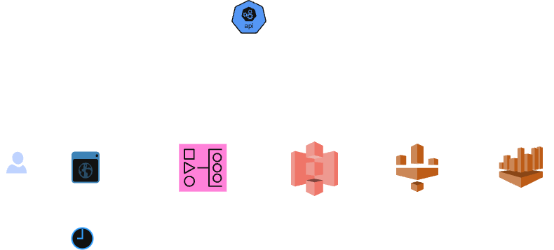

# AImonitoring

An AWS data lake pipeline that monitors the AI ecosystem: ingesting model pricing, GPU rental costs, model intelligence scores into a medallion architecture queryable via Athena.

## Architecture



Stack: Python · Apache Airflow · AWS S3 · AWS Glue · Amazon Athena · PyArrow · Pytest · GitHub Actions

## Data Sources
 
All data is ingested from the [TensorFeed API](https://tensorfeed.ai/developers):
 
| Endpoint | Glue Table | Schedule |
|---|---|---|
| `/api/news` | `news` | Daily |
| `/api/models` | `models`, `providers` | Daily |
| `/api/gpu/pricing` | `gpu_pricing` | Daily |
| `/api/intelligence` | `intelligence` | Daily |
 
## Project Structure
 
```
dags/
├── ai_monitoring.py       # main DAG — ingest → transform → crawl
└── utils/
    ├── s3.py              # upload/download helpers
    ├── parquet.py         # pyarrow conversion
    └── transformation.py  # data cleaning and flattening
    └── ingestion.py       # API fetching

 
tests/
├── test_transformation.py # unit tests
└── test_integration.py    # S3 integration tests with moto
 
.github/
└── workflows/
    └── ci.yml             # lint + test on every push
```
 
## Medallion Architecture
 
```
bronze  →  s3://bucket/raw/      JSON as returned by the API
silver  →  s3://bucket/silver/   Parquet, cleaned and flattened
```
 
The Glue Crawler runs after each transformation and updates the Data Catalog, making all silver tables immediately queryable via Athena.
 
## Analytical Queries
 
**Best cost-efficiency: intelligence score per dollar**
```sql
SELECT
    model_id,
    provider_id,
    tfii_score,
    input_price,
    ROUND(tfii_score / NULLIF(input_price, 0), 2) AS intelligence_per_dollar
FROM models
WHERE tfii_score IS NOT NULL AND input_price > 0
ORDER BY intelligence_per_dollar DESC;
```
 
**Cheapest H100 across providers today**
```sql
SELECT provider, gpu_raw, on_demand_usd_hr, spot_usd_hr
FROM gpu_pricing
WHERE gpu_canonical = 'H100'
ORDER BY on_demand_usd_hr ASC;
```
 
**Most covered news categories this week**
```sql
SELECT
    categories,
    COUNT(*) AS article_count
FROM news
WHERE published_at >= CURRENT_DATE - INTERVAL '7' DAY
GROUP BY categories
ORDER BY article_count DESC;
```
 
**Model count per provider**
```sql
SELECT provider_id, COUNT(*) AS model_count
FROM models
GROUP BY provider_id
ORDER BY model_count DESC;
```
 
## Running Locally
 
**Prerequisites:** Docker, AWS credentials configured
 
```bash
git clone https://github.com/leandrotiburske/ai-monitoring.git
cd ai-monitoring
cp .env.example .env  # fill in your AWS credentials and bucket name
docker-compose up
```
 
Airflow will be available at `http://localhost:8080`. Trigger the `ai-monitoring` DAG manually to run the full pipeline.
